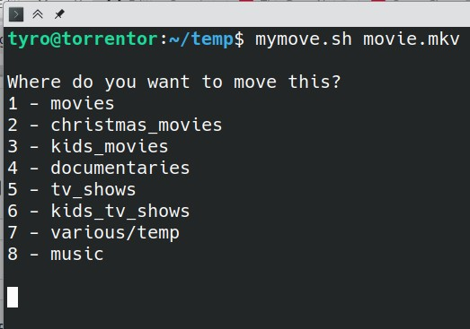
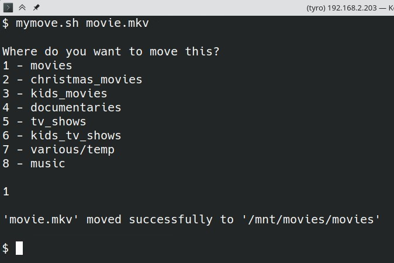

# Move-files
This is a bash script I created to make moving files around my server easier.  
Path structions can be complex, and having to remember them is a pain.
With this script I simply enter the script name along with the file or folder I want to move, it then presents me with a number of selections, and I simply enter the corresponding number.  The file/folder will then be moved to the appropriate location.

